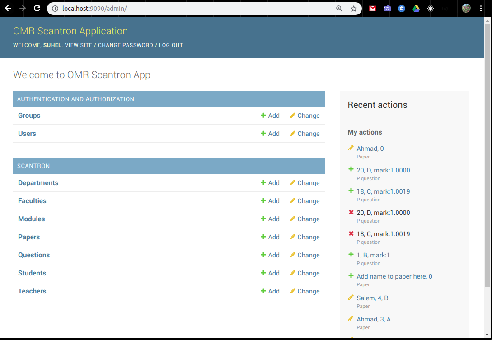
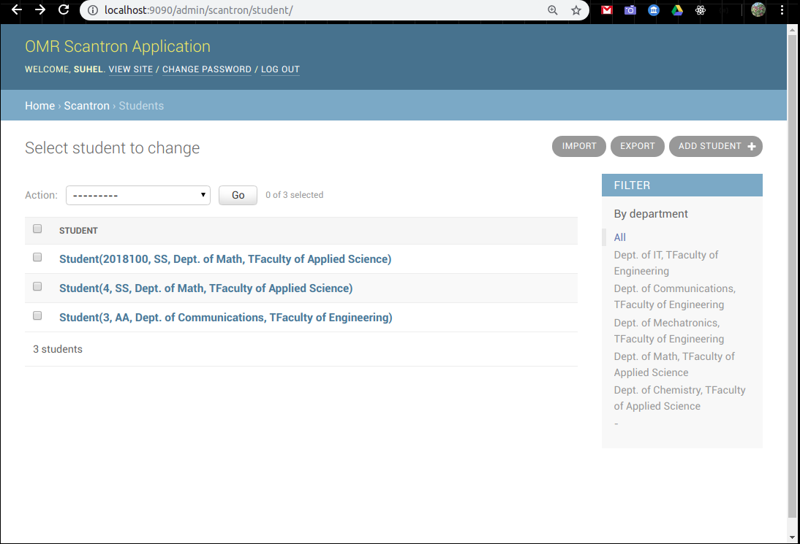
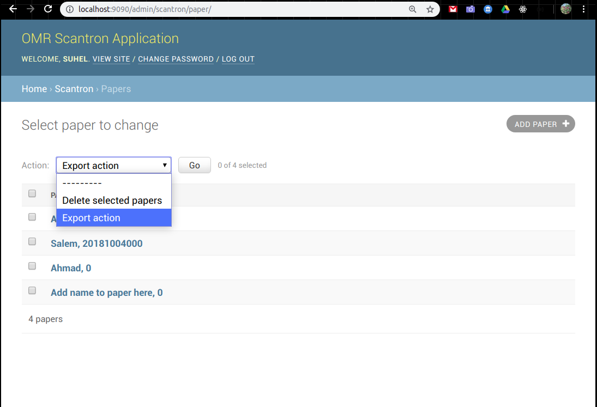
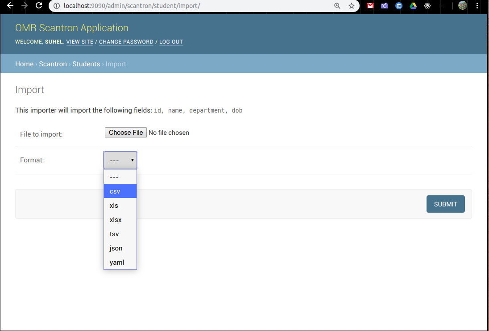
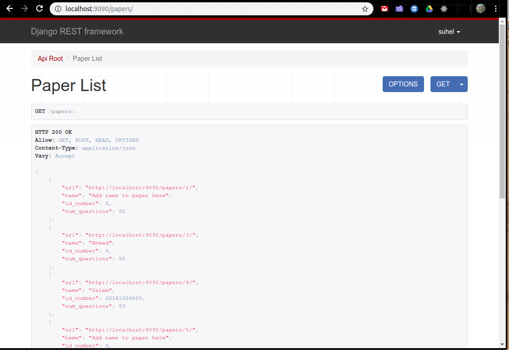

# Scantron

An early skeleton project. To be used with [OMR app](https://github.com/suhelhammoud/omr) once finished.

Backend is using [django](https://www.djangoproject.com/) web framework

### Python commands

using separte vitual environment for python

```console
$virtualenv venv -p python3
$. venv/bin/activate
$source venv/bin/activate
$cd to_site_folder
$pip install -r requirements.txt
```

In windows

```console
$.\venv\Scripts\activate.bat
```

Output installed packages in requirements format.

```console
pip freeze > requirements.txt
```

Install all libraries in requirements.txt

```bash
$pip install -r requirements.txt

```

### Django Commands

```bash
$python manage.py makemigrations
$python manage.py migrate
$python manage.py runserver 9090
$python manage.py test
```

Screenshots of current admin functions:











